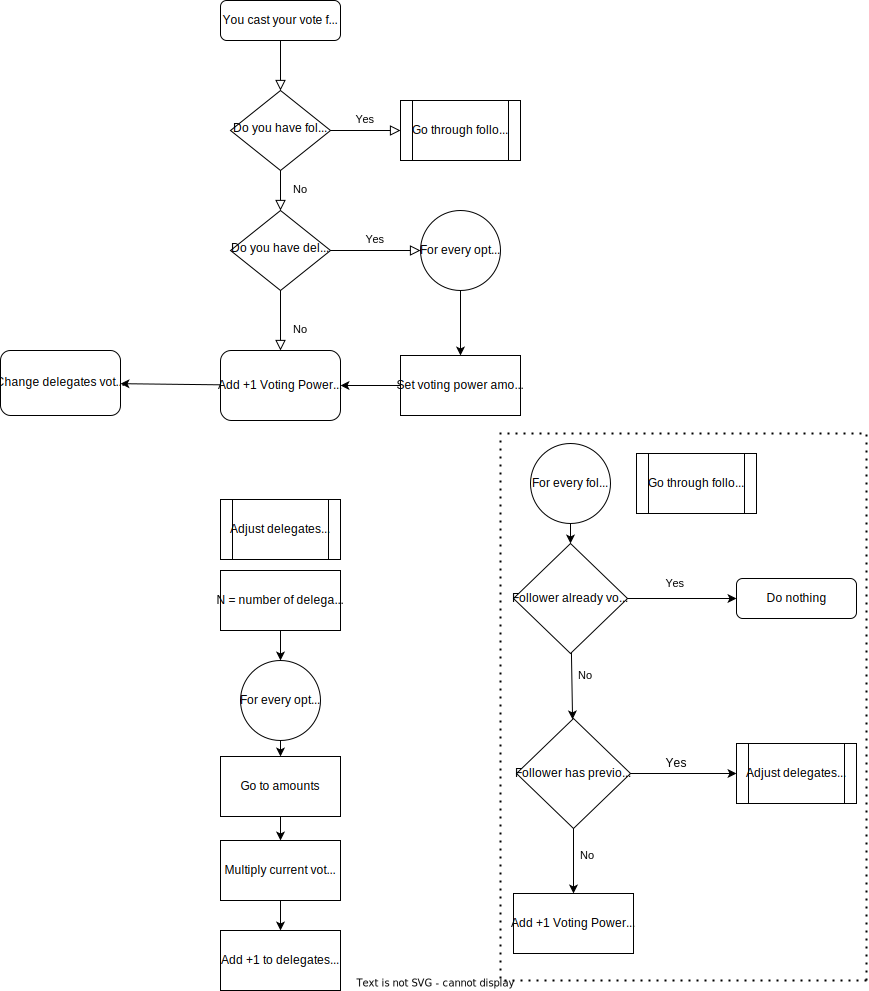

# chainlink-hackathon-project
Permanent voting system with partial vote delegation. 

# How it works

There are currently two parts: Smart Contract keeping registry of users who voted for each option and delegation graph which is used to delegate one's voting power and provide ability to delegate to multiple users. Voting process is permanent
## Rules regarding voting power
  - Voting power of each voter for their own vote is **ALWAYS EQUAL TO 1**
  - User's own vote always takes priority and overrides any votes cast in his stead by any delegates
  - Delegated power is calculated on per follower basis and is equal to ***1 / (totalDelegatesVotedInPlaceOfParticlularFollower)***
  - Total voting power of the user is **ALWAYS EQUAL TO 1** regardles of number of delegates voted

## Diagram of logic behind casting a vote

## Installation steps

1. Clone repo
2. npm install
3. npm run start (to start frontend on  localhost:3000)
4. cd server
5. npm install
6. npm run start (to start backend on localhost:9000)

## Diagram of logic behind retracting a vote (casting a vote for "CLEAR VOTE" option)

__TBD__
# Project todo list (from the top of my head in no particular order)

 - Figure out authentication and account verification
 - Non-universal proposals and proper voting rights assignment for them
 - Test coverage for contracts
 - Proposal generating logic (smart-contract creation logic)
 - Proposal explorer
 - Beautiful and high-utility UI
 - Resource allocation based on currently winning option
 - Timelock before re-allocationg resources, to prevent too high frequency of reso (like a week or two)
 - Recommendati on engine for like-minded people to add as your delegates
 - Experiments with voting power to 100 to give users ability to propotionally allocate their voting power